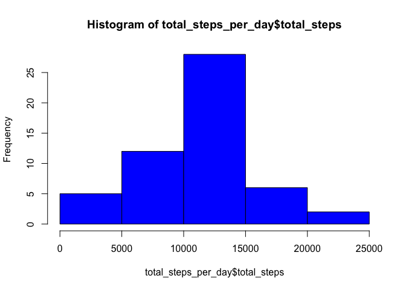
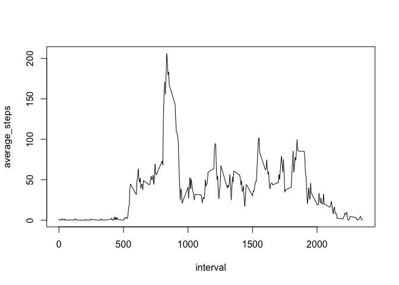
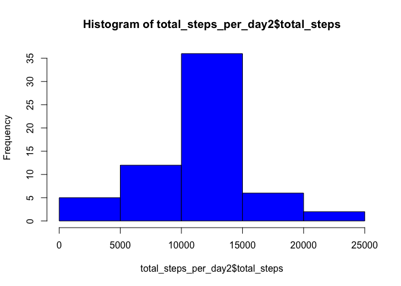

# Reproducible Research: Peer Assessment 1


## Loading and preprocessing the data

```r
activity <- read.csv(file = "activity.csv")
```

## What is mean total number of steps taken per day?


```r
library(dplyr)
```

```
## 
## Attaching package: 'dplyr'
## 
## The following objects are masked from 'package:stats':
## 
##     filter, lag
## 
## The following objects are masked from 'package:base':
## 
##     intersect, setdiff, setequal, union
```

```r
activity2 <- subset(activity, !is.na(steps))
by_date <- group_by(activity2, date)
total_steps_per_day <- summarise(by_date, total_steps = sum(steps))
hist(total_steps_per_day$total_steps, col = "blue")
```

 

```r
mean(total_steps_per_day$total_steps)
```

```
## [1] 10766.19
```

```r
median(total_steps_per_day$total_steps)
```

```
## [1] 10765
```

## What is the average daily activity pattern?

```r
by_interval <- group_by(activity2, interval)
mean_steps_per_interval <- summarise(by_interval, average_steps = mean(steps))
plot(average_steps ~ interval, mean_steps_per_interval, type="l")
```

 

```r
subset(mean_steps_per_interval, average_steps == max(average_steps))[1]
```

```
## Source: local data frame [1 x 1]
## 
##   interval
## 1      835
```

## Imputing missing values

```r
sum(is.na(activity$steps))
```

```
## [1] 2304
```

```r
data <- cbind(activity, avg_steps = mean_steps_per_interval$average_steps)
for (i in 1:length(data$steps)) {if(is.na(data[i, 1])) data[i, 1] <- data[i, 4]}
filled_activity <- select(data, 1:3)
by_date2 <- group_by(filled_activity, date)
total_steps_per_day2 <- summarise(by_date2, total_steps = sum(steps))
hist(total_steps_per_day2$total_steps, col = "blue")
```

 

```r
mean(total_steps_per_day2$total_steps)
```

```
## [1] 10766.19
```

```r
median(total_steps_per_day2$total_steps)
```

```
## [1] 10766.19
```


## Are there differences in activity patterns between weekdays and weekends?

```r
data <- mutate(filled_activity, day_type = weekdays(as.Date(filled_activity$date)) == c("Saturday", "Sunday"))
```
